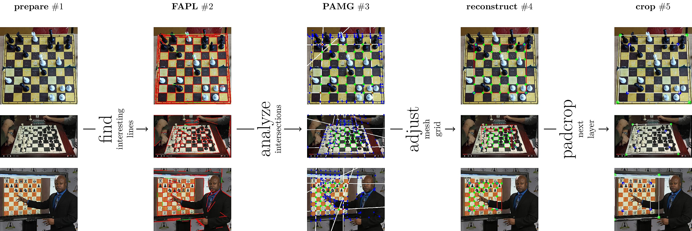

> _Computer Vision! Machine learning! A E S T H E T I C!_


# Neural Chessboard

An Extremely Efficient Chess-board Detection for Non-trivial Photos

----

We present a set of algorithms that can be used to locate and crop the chess-board/chess-pieces from the picture, including every rectangular grid with any pattern.
Our method is non-parametric, and thus does not require the prior knowledge from
computer vision and machine learning, which is instead inferred from data.
We illustrate the application of our method to a variety of examples, such as
chess-board cropping and regular grid-pattern localization.
In addition, we present two independent algorithms: PAMG (vertices detector) and
FAPL (thermal lines) that can be widely used for other tasks in computer vision.



----

**Files:**

```bash
$ # basic
$ python3 detect <filename>          # detect and crop chess-board from a photo
$ python3 fen <filename>             # generate FEN from a cropped photo
$ # utils
$ python3 dataset                    # prepare a dataset (for detector)
$ python3 train                      # learn PAMG (neural network)
```

**Dependencies:**

- [Python 3](https://www.python.org/downloads/)
- [Scipy 0.19.1](https://www.scipy.org/)
- [OpenCV 3](http://opencv.org/)
- [Tensorflow](https://www.tensorflow.org/) (with [tflearn](https://github.com/tflearn/tflearn) support)
- [Networkx](https://networkx.github.io/) and [Pyclipper](https://github.com/greginvm/pyclipper)

**TODO:**

- [X] **Board Detection**: _detect board and segment into 8x8 squares_
	> "An Extremely Efficient Chess-board Detection for Non-trivial Photos" -- M. A. C.
- [ ] **Piece Recognition**: _identify chess pieces from a cropped board_
	> (currently using Jialin Ding method, but we are preparing something completely new)

----

**BONUS (old gif):**


